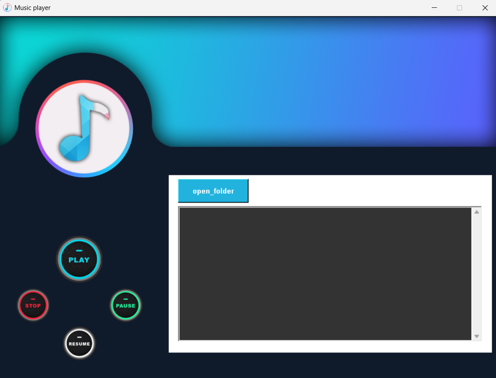

# Music Player (Tkinter & Pygame)

## Overview
This is a simple GUI-based music player built using Python's `tkinter` for the interface and `pygame` for audio playback. It allows users to open a folder, select MP3 files, and play, pause, resume, and stop music.

## Features
- Load and play MP3 files from a selected folder
- Play, pause, resume, stop music
- User-friendly interface with graphical buttons
- Playlist display with a scrollbar
- Minimalistic and stylish UI

## Installation

### Prerequisites
Ensure you have Python installed on your system. You can download it from [Python's official site](https://www.python.org/downloads/).

### Install Required Libraries
Run the following command to install the necessary dependencies:
```sh
pip install pygame tkinter
```

## How to Use
1. Run the Python script:
   ```sh
   python guimini.py
   ```
2. Click the "Open Folder" button to select a folder containing MP3 files.
3. Select a song from the playlist and click the "Play" button.
4. Use the pause, resume, stop, and next buttons as needed.

## Screenshots
Here’s a preview of the Music Player:




## Issues & Contributions
Feel free to raise an issue or contribute by submitting a pull request.

## License
This project is licensed under the MIT License.

---

### Author
Developed by **Nikhil Chopade**

